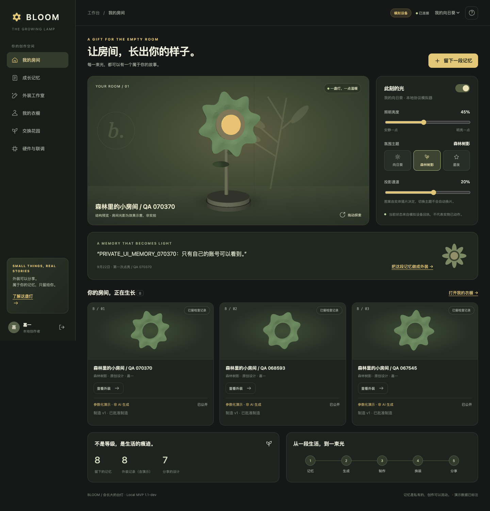

# SUNNY — The Growing Sunflower Lamp

A personal lamp that grows with your stories: turn a memory into a changeable sunflower-inspired exterior, review its manufacturing version, and make it part of your room.

SUNNY is a runnable local software MVP with editable CAD, exported STL parts, and an ESP32 firmware prototype. The workspace connects private memories, reference images, exterior creation, 3D previews, manufacturing review, fabrication records, simulated NFC binding, and version-specific sharing/remixing.

**Status:** software prototype. Physical assembly, electrical/thermal/optical validation, and real paid Tripo generation are not yet verified. Default generation is explicitly labeled as a local parametric demo. Tripo API integration is implemented, but is not claimed as a verified real generation result.

**Tripothon direction:** Physical Design. See [submission materials](docs/TRIPOTHON-SUBMISSION.md).



## Run locally

Python 3.10+ is required. Follow the commands below to start the local demo; this repository does not deploy the Python backend to GitHub Pages.

## 项目资料

项目原名为 BLOOM，历史工程目录及技术标识保留以兼容已有数据。已完整解压 `BLOOM-complete-MVP-hardware-docs.zip`，正在其源码上继续开发。`BLOOM-complete-delivery/` 是当前工作副本，已包含新改动；下载目录的原始 ZIP 保持不变。

当前优先开发软件，硬件与实物验收暂缓。最新实现、测试结果与未完成项见 [软件开发进度](docs/mvp-v3/05-软件开发进度.md)。

- [完整开发板块与总体排期 v3（当前规划入口）](docs/mvp-v3/01-开发板块与总体排期.md)
- [60 项详细开发任务清单](docs/mvp-v3/02-详细开发任务清单.md)
- [数据、接口与业务规则](docs/mvp-v3/03-数据接口与业务规则.md)
- [验收与交付计划](docs/mvp-v3/04-验收与交付计划.md)
- [MVP 总体规划 v2（历史版本）](docs/BLOOM-MVP总体规划-v2.md)
- [初始 MVP 分析与开发计划](docs/MVP分析与开发计划.md)
- [原项目运行说明](BLOOM-complete-delivery/01_MVP项目/growing-lamp-mvp/README.md)
- [制作记录、照片与返工](BLOOM-complete-delivery/01_MVP项目/growing-lamp-mvp/docs/FABRICATION.md)
- [模型预览与可追溯适配](BLOOM-complete-delivery/01_MVP项目/growing-lamp-mvp/docs/GEOMETRY.md)
- [打印前已知问题](BLOOM-complete-delivery/03_补充说明/打印前必读_已知问题与验证边界.md)
- [本次检查记录](evidence/2026-09-21-local-assessment.json)

在本项目根目录启动（需要 Python 3.10+，本机已用 Python 3.13.14 验证）：

```bash
python3.13 -m venv .venv
.venv/bin/python -m pip install -r BLOOM-complete-delivery/01_MVP项目/growing-lamp-mvp/requirements.txt
.venv/bin/python run.py --data .runtime/software-demo
.venv/bin/python check.py
```

打开 http://127.0.0.1:8787 。默认含模拟设备和参数化演示，不代表真实硬件或 Tripo 已验证。
